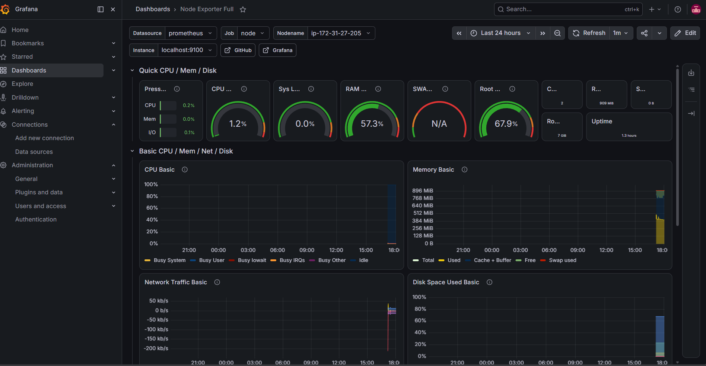

# 🔥 DEVOPS RAIZ — MONITORAMENTO EC2 (PROMETHEUS + GRAFANA + NODE EXPORTER)

## 💀 Visão geral (sem enrolação)

Stack de observabilidade rodando em uma EC2 Ubuntu:
```
EC2
├── Node Exporter (9100)  -> métricas do sistema
├── Prometheus (9090)     -> coleta e armazena métricas
└── Grafana (3000)        -> dashboards
```
---

## 🧱 REGRAS DO JOGO

- Tudo roda via systemd
- Nada de processo manual em produção
- Tudo precisa estar UP no /targets


---

## 📦 NODE EXPORTER

### Instalação

```
wget https://github.com/prometheus/node_exporter/releases/download/v1.8.2/node_exporter-1.8.2.linux-amd64.tar.gz
tar -xvf node_exporter-1.8.2.linux-amd64.tar.gz
sudo mv node_exporter /usr/local/bin/
 ```

### Service (systemd)

 ``` sudo nano /etc/systemd/system/node_exporter.service 
 ```

``` 
[Unit]
Description=Node Exporter
After=network.target

[Service]
User=ubuntu
ExecStart=/usr/local/bin/node_exporter

[Install]
WantedBy=multi-user.target

```

### Start
```
sudo systemctl daemon-reload
sudo systemctl enable node_exporter
sudo systemctl start node_exporter
```
---

## 📡 PROMETHEUS

### Estrutura
```
sudo useradd --no-create-home --shell /bin/false prometheus
sudo mkdir -p /etc/prometheus /var/lib/prometheus
```

### Config (/etc/prometheus/prometheus.yml)
```
global:
  scrape_interval: 15s

scrape_configs:
  - job_name: "prometheus"
    static_configs:
      - targets: ["localhost:9090"]

  - job_name: "node"
    static_configs:
      - targets: ["localhost:9100"]

```
 
 
### Service


``` sudo nano /etc/systemd/system/prometheus.service 
```

```
[Unit]
Description=Prometheus
Wants=network-online.target
After=network-online.target

[Service]
User=prometheus
Group=prometheus
ExecStart=/usr/local/bin/prometheus \
  --config.file=/etc/prometheus/prometheus.yml \
  --storage.tsdb.path=/var/lib/prometheus

[Install]
WantedBy=multi-user.target

```

### Fix clássico de erro

``` sudo chown -R prometheus:prometheus /var/lib/prometheus /etc/prometheus
```

### Start
```
sudo systemctl daemon-reload
sudo systemctl enable prometheus
sudo systemctl start prometheus
```


## 📊 GRAFANA

### Install

```
sudo apt update
sudo apt install -y grafana
```

### Start
```
sudo systemctl enable grafana-server
sudo systemctl start grafana-server
```

### Acesso
http://IP:3000
admin / admin

---

## 🔗 INTEGRAÇÃO

Grafana -> Data Source:
http://localhost:9090

---

## 📈 DASHBOARD RAIZ

Importar:
1860 (Node Exporter Full)

---

## 🚨 CHECKLIST RAIZ

- [ ] node_exporter:9100 UP
- [ ] prometheus:9090 UP
- [ ] grafana:3000 UP
- [ ] /targets tudo verde

---

## 💀 DEBUG RÁPIDO

Prometheus não sobe:
- permission denied -> chown -R prometheus
- YAML quebrado -> identação errada
- port busy -> outro processo rodando

Node Exporter DOWN:
- não está rodando systemd
- porta 9100 fechada

Grafana vazio:
- datasource errado (URL errada)

---
## Dashboard em funcionamento

Screenshot do ambiente após integração completa entre Node Exporter, Prometheus e Grafana:



### Evidências observadas

- Prometheus: UP
- Node Exporter: UP
- Grafana conectado ao datasource Prometheus
- CPU, memória, disco e rede sendo coletados
- Host monitorado: ip-172-31-27-205

---

## Arquitetura

EC2 → Node Exporter → Prometheus → Grafana

---

Stack validada com sucesso em ambiente AWS EC2 Ubuntu.